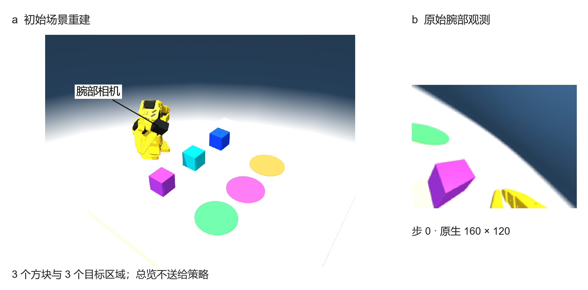
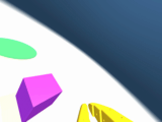
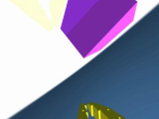
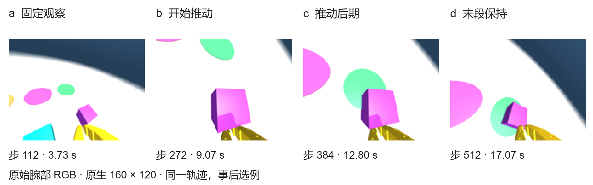
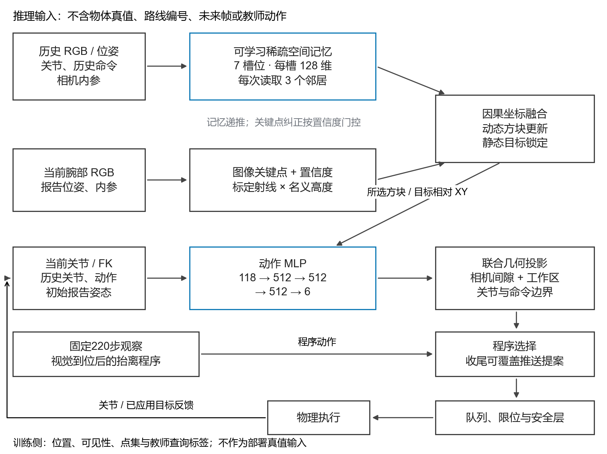
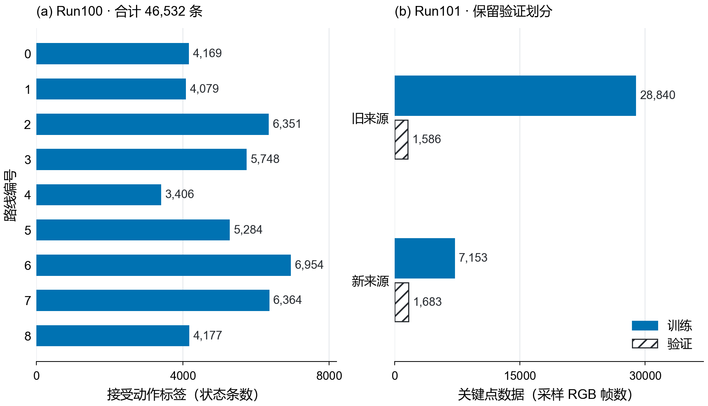
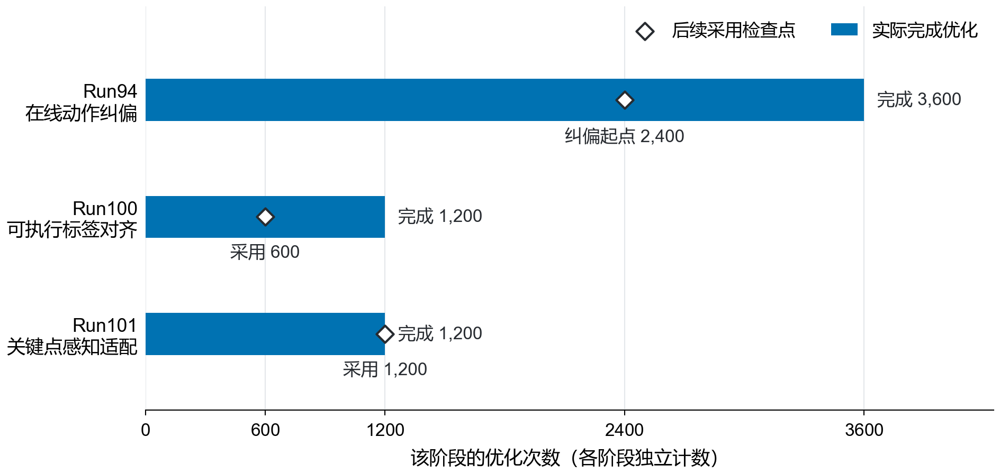
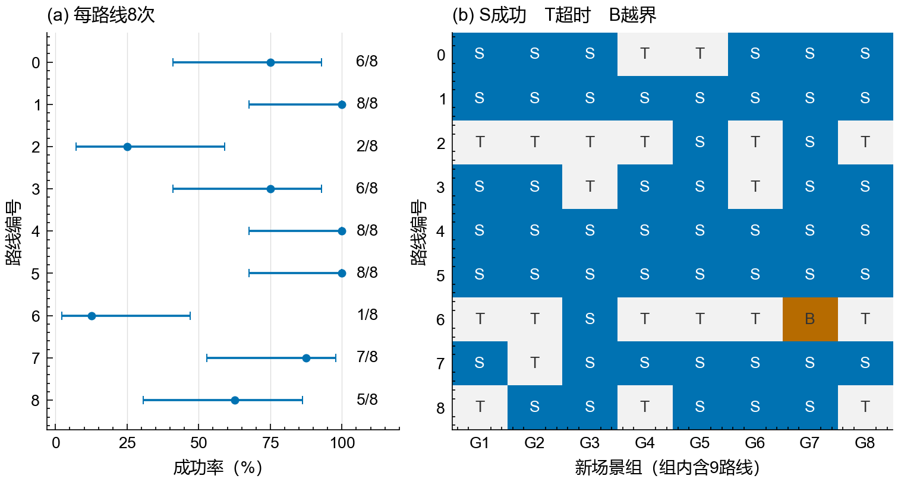

# EdgeArm · 从单腕部视觉到闭环推块

### 动作条件化空间记忆、合成数据与分阶段策略训练技术报告

[English / Quick start](README.en.md) · [模型与视频](https://github.com/Tangtaizong-BUAA/EdgeArm/releases/tag/v0.1.0) · [Hugging Face](https://huggingface.co/YuxuanGong/EdgeArm-Run102) · [训练入口](docs/training.md) · [数据格式](docs/data.md)

**一只腕部相机，三个方块，三个目的区域。** 给定“将紫色方块推到绿色区域”这样的指令，机器人需要记住暂时离开画面的目标，持续估计被推动物体的位置，调整接触动作，并让目标物在目的区域稳定停留 **3 秒**。

EdgeArm 将这个问题组织为一条可追踪的训练主线：**连续序列学习空间记忆 → 学生访问状态上的动作纠偏 → 执行一致的监督标签 → 当前视觉适配 → 冻结闭环评估**。项目也实现了 ACT 模仿学习、自动轨迹合成和在线残差 RL；它们既提供了数据与基线，也帮助定位最终方案必须解决的问题。

| 最终独立评估 | 观测方式 | 任务覆盖 | 发布内容 |
|:--|:--|:--|:--|
| **51 / 72，70.83%** | 腕部 RGB + 关节与动作历史 + 标定 | 8 个新场景组 × 9 条等权路线 | 代码、训练配方、四个权重、评估演示 |



*图 1｜左侧依据冻结代码与本地几何资产重建初始场景，帮助理解布局；右侧是存档腕部画面。总览相机不输入策略。*

## 1. 先看机器人实际看到了什么

| 成功案例 · seed 882000900 | 超时案例 · seed 882000902 |
|:--:|:--:|
| [](https://github.com/Tangtaizong-BUAA/EdgeArm/releases/download/v0.1.0/run102-success-882000900.mp4) | [](https://github.com/Tangtaizong-BUAA/EdgeArm/releases/download/v0.1.0/run102-timeout-882000902.mp4) |
| [完整 MP4 · 17.33 秒](https://github.com/Tangtaizong-BUAA/EdgeArm/releases/download/v0.1.0/run102-success-882000900.mp4) | [完整 MP4 · 30.13 秒](https://github.com/Tangtaizong-BUAA/EdgeArm/releases/download/v0.1.0/run102-timeout-882000902.mp4) |

这是 **Run102 独立评估的原始腕部 RGB 回放**，不是训练视频或重新运行模型。每类选取最小 seed 的一个案例作为说明，不以个例替代总体成绩。控制频率为 30 Hz，原档每 8 步保存一帧，因此视频按 **3.75 fps** 播放；仅最近邻放大和编码，没有补帧或生成画面。末帧不必恰好等于成功判定瞬间。[媒体来源与校验](docs/media/README.md)



*图 2｜腕部视野随动作变化：看见过不代表现在还看得见，保存过坐标也不代表物体仍在原地。这正是空间记忆与当前视觉需要协作的原因。*

## 2. 问题定义：预测动作不等于完成任务

场景中有 3 个方块和 3 个不重叠目标区域，起点—目标组合形成 9 条路线。指令由七种语义颜色显式解析，选择目标物体与区域。最终评估从任务条件化的 `CONTACT_TRANSPORT_HOLD` 姿态开始，每次最多 900 个控制步。

成功同时要求：

- 方块投影的 **17 × 17 采样网格至少 95%** 位于目标区内；
- 线速度不超过 **0.025 m/s**，角速度不超过 **0.55 rad/s**；
- 连续保持 **3 秒**，且不触发硬失败或方块越界。

因此，接触到方块、短暂进入目标区、离线动作误差下降，都只是中间信号。真正训练的是“观察—估计—动作—反馈—纠偏—保持”的循环。

| 难点 | 对训练的要求 | 采用的处理 |
|:--|:--|:--|
| 方块与目标不总在同一画面 | 利用历史而非只看当前帧 | 因果空间记忆 + 静态目标保留 |
| 机器人和相机一起运动 | 区分相机运动与物体运动 | 报告关节 FK、标定、动作条件状态转移 |
| 学生会离开示范轨迹 | 覆盖模型真正访问的偏离状态 | DAgger 在线查询与监督聚合 |
| 请求动作不等于实际执行 | 标签与部署约束一致 | 联合几何投影 + 执行反馈 |
| 接触后定位误差累积 | 适配自主运行时的画面 | 访问状态视觉重放与关键点训练 |

## 3. 最终架构：以空间状态连接视觉与控制



*图 3｜最终部署信息流。蓝框表示主要学习模块；固定观察、标定回投、目标锁定与联合约束是工程组件。训练侧物体真值不进入部署输入。*

1. **历史感知**：因果 RGB、相机位姿与内参进入视觉编码和空间记忆。
2. **当前纠错**：关键点网络逐步处理当前腕部图像，补偿物体被推动后的快速位移。
3. **空间融合**：动态方块持续更新；静态目标从多次可信观测中保留位置。
4. **反馈控制**：估计相对 XY、本体状态及动作历史共同进入动作 MLP。
5. **实际执行**：命令经过联合约束、程序选择、队列与安全层执行，报告状态反馈到下一步。

动作网络为 **118 → 512 → 512 → 512 → 6**，隐藏层使用 SiLU：

| 输入/输出 | 内容 | 来源 |
|:--|:--|:--|
| 114 维本体与历史 | 当前关节、速度、末端 FK、四次关节报告、四次提交命令、上一应用目标、初始报告关节 | 已发生的状态与控制记录 |
| 4 维空间关系 | 所选方块与目标的相对 XY | 视觉与记忆估计 |
| 6 维输出 | 六个关节的命令表示 | 按版本化动作协议转换执行 |

输出不能直接当作原始弧度解释。这个接口让模型既知道“物体在哪里”，也知道“自己发过什么命令、关节是否跟上”，同时使感知误差与控制误差可以分开诊断。

## 4. 空间定位：把前序影像和运动变成持续更新的记忆

核心设计是 **动作条件化、语义槽位化、稀疏交互的时序空间状态**：将空间理解从单张图片回归，改成沿机器人动作递推的估计过程。

### 4.1 七个槽位、五十六个稀疏表面点

系统维护 7 个槽位：4 种候选方块颜色和 3 种目标颜色，单场景实际出现其中 3 个方块。每槽保存 128 维隐特征、三维位置、逐轴方差和已观测标记，并预测 8 个表面点，共 56 点。点集提供几何辅助监督，不直接输入最终动作网络。

每个槽位只读取最相关的 **3 个邻居**。分数同时考虑特征相似性与空间距离，而不是对全部历史帧无差别做稠密注意力。

### 4.2 先预测运动，再用画面纠正

概念上，每个槽位经历以下更新；精确实现见 [`run82_spatial_model.py`](Simulation/EdgeArm/edgearm/run82_spatial_model.py)：

$$
\hat{\mathbf p}_{t}^{-}=\hat{\mathbf p}_{t-1}+d\,f_{motion}(\mathbf h_{t-1},\mathbf c_t,\hat{\mathbf p}_{t-1})\,\Delta t,
\qquad
\hat{\mathbf p}_t=\hat{\mathbf p}_{t}^{-}+\mathbf K_t(\mathbf z_t-\hat{\mathbf p}_{t}^{-}).
$$

$d$ 区分动态方块与静态目标，$\mathbf c_t$ 来自已发生的本体和动作历史；$\mathbf z_t$ 是图像估计，$\mathbf K_t$ 结合写入门、可见性与位置方差。动态物体先预测有界位移，静态目标不施加相同运动项。稀疏邻居、视觉特征与本体上下文共同进入 GRU，更新隐状态。

因此记忆不是“上一帧缓存”：**动作改变先验，视觉纠正先验，不确定度决定信任程度。** 当前图像不可靠时有状态可以保留，物体移动后又能修正旧估计。

### 4.3 快视觉与慢记忆

最终系统通常每 8 个控制步更新空间记忆，固定观察结束后每步运行当前关键点网络。关键点经标定射线与名义高度转换为空间测量，高置信且与近期状态一致的测量用于纠错。静态目标使用至少 3 次高置信观测的中位数锁定。

这是操作任务中的**稀疏 3D + 时间表征**：学习运动先验、记忆读写和点集，同时保留几何先验，不要求先重建稠密地图才能控制。标定回投不是学得深度；这里展示项目实现与组合设计，不作“首创完整 4D 重建”的主张。

## 5. 数据合成：一条物理轨迹，多种一致监督

管线从采集开始保留时间、动作语义与来源，避免图片、关节、命令虽然齐全，却对应不同执行时刻。

| 数据层 | 如何生成 | 怎样用于学习 |
|:--|:--|:--|
| 人工仿真 | 键盘控制、命令与反馈记录、后续 RGB 物化 | 初始模仿、人工动作覆盖与回练 |
| 自动仿真路径 | 已有策略/恢复教师执行，保留完整因果记录 | 基础轨迹、困难路径与恢复状态 |
| 学生访问状态 | 学生运行后查询当前状态的教师动作 | 覆盖模型自己的偏离分布 |
| 视觉重放 | 保存命令重放，核对状态与原 RGB | 关键点、可见性、几何标签 |
| 一致颜色增广 | 同时改变图像、历史、颜色标签和指令 | 打破颜色与位置的偶然绑定 |
| 连续空间序列 | RGB、位姿、内参、历史、点集按时间组织 | 记忆递推、运动与不确定度学习 |

人工实机是整体采集设计中的独立来源，不计入本次仿真结果的实机能力证明。历史随机化接口可扩展摩擦、位置与视觉条件；最终 70.83% 对应声明的名义仿真范围，不等于所有随机化工况成绩。

### 5.1 物理路径与视觉生成解耦

路径生成、命令执行、状态记录、RGB 物化可以分开调度：CPU 承担并行物理与路径工作，渲染与网络更新交给具备相应图形/GPU 能力的节点。物化前后核对动作协议、关节状态、方块位置和抽样 RGB，不把“能渲染视频”当作“数据已经对齐”。

同一批路径可以生成多种训练视图，减少反复物理探索。实际吞吐需要分解测量物理、渲染、推理、更新和等待，不能仅凭显存占用判断效率。

### 5.2 颜色变换是整个任务的一致变换

旧批 **108 条物理轨迹**采用原色加 3 套固定颜色双射，得到 **432 个派生图像序列、35,184 个时刻**。同步重命名指令、历史图像和空间标签，机器人与桌面保持不变。只换当前图像而不换语言和历史，会制造矛盾监督。

432 是图像序列数，不是 432 次物理探索；同一物理轨迹的变体不跨训练/验证集合。

### 5.3 因果输入与特权标签分离

```text
inputs.npz                         labels.npz
  RGB、相机位姿、内参                物体 XYZ、稀疏表面点
  已发生的关节与动作历史             存在性、可见性
  时间、指令选择                     教师命令、动作有效标记
          │                               │
          └── 学生前向计算 ── 训练损失 ──────┘
```

先固定学生输入与预测，再查询教师或读取仿真标签；部署时只有左侧。失败轨迹也能贡献局部恢复标签，但不会把失败学生动作直接作为成功示范。

## 6. 最终训练主线：分别适配空间、控制与感知

| 阶段 | 更新对象 | 数据与目标 | 保持固定 | 实际选用 |
|:--|:--|:--|:--|:--|
| A · 空间学习 | 视觉、记忆、辅助几何/动作头 | 连续序列、位置、运动、点集、可见性 | 因果输入协议与划分 | Run82 · update 500 |
| B · 在线纠偏 | 动作 MLP | 学生状态教师查询 + 旧功能回练 | 空间与感知 | Run94 · round 2 作为起点 |
| C · 执行对齐 | 动作 MLP | 联合投影后的教师命令 | 感知与约束 | Run100 · update 600 |
| D · 感知适配 | 当前关键点网络 | 新旧图像、可见/缺席热图、位置 | 空间、动作与执行规则 | Run101 · update 1200 |
| E · 独立评估 | 无更新 | 新场景完整任务 | 全部权重、源码与选项 | Run102 · 72 次 |

### A. 连续序列学习空间状态

长度 12 的连续片段用于截断反向传播；同一轨迹的片段之间延续记忆，换轨迹才初始化。每批九路线各取一条序列，不用真值逐步重置记忆。连续遮挡增强促使模型利用前序状态和动作。

$$
\mathcal L_{space}=\mathcal L_{pos}+0.25\mathcal L_{motion}
+0.15\mathcal L_{points}+0.15\mathcal L_{vis}
+0.01\mathcal L_{unc}+\lambda_a\mathcal L_{act}.
$$

位置和运动先验使用归一化 Smooth-L1，点集使用双向最近邻距离，可见性用二元交叉熵；不确定度项将误差与方差联系。几何误差以 20 mm 为尺度，动作辅助系数前 200 次更新为 0.25，之后为 1。

AdamW 对视觉、基础动作和新增空间模块分别使用 $10^{-5}$、$3\times10^{-5}$、$2\times10^{-4}$ 学习率，梯度范数上限 5。初训中的辅助动作头不作为最终执行 actor。

### B. DAgger：教模型从自己走偏的位置继续

Run94 进行了 **3 × 36 = 108 次新物理尝试**，每 15 步片段决定是否执行教师，三轮概率为 **0.5 / 0.25 / 0**。最后一轮只执行学生动作，但训练侧仍可查询教师；开发与独立测试不执行教师。

教师依据工具—方块—目标关系生成推送、抬起、对齐、下降或保持动作，再用阻尼最小二乘 Jacobian 转为关节命令。教师是训练数据生成器，不是部署策略。

$$
\mathcal L_{control}=\mathcal L_{teacher}+0.2\mathcal L_{replay}+0.02\mathcal L_{anchor}.
$$

每次采新状态 576 个、旧状态 288 个，各来源内部九路线等权。旧回练来自 18,040 个历史状态上的冻结网络预测，保留已有行为；锚点抑制当前状态上过快漂移。新位置估计加入 2 mm 标准差抖动。AdamW $2\times10^{-5}$，完成 3 × 1,200 次更新，梯度范数上限 1。

### C. 执行一致性：监督与部署使用同一种动作含义

执行审计曾发现：为抬高相机提出的关节目标使工具越出工作区，后续整体缩放又削弱相机间隙。逐项修正可能互相抵消，因此采用 **SLSQP 联合投影**，同时处理相机—桌面间隙、工具工作区、关节范围与单步命令界限。

Run100 保持原 118 维学生输入，将 46,547 条教师查询投影到部署侧同一声明可行域：**46,532 条接受，15 条剔除，947 条最大关节改变量超过 1 mrad**。投影只读取报告关节、速度和静态几何，不读取物体真值。

冻结感知，以教师/回练/锚点损失、AdamW $10^{-5}$ 完成两轮各 600 次更新。选择完整开发中平均覆盖更高的第一轮动作，而非默认最后权重。

### D. 访问图像适配：纠偏轨迹也修正“看错”

同批 108 条轨迹用于视觉重放，每 8 步抽样。90 条感知训练、18 条感知验证，得到 **7,153 / 1,683 帧**；旧来源为 **28,840 / 1,586 帧**。这是物理轨迹复用，不是额外 108 次探索。感知验证组此前参与动作学习，不替代系统独立测试。

关键点网络输出七个语义通道的中心热图和缺席概率：

$$
\mathcal L_{keypoint}=\mathcal L_{visible}+\mathcal L_{absent}+0.5\mathcal L_{pixel}.
$$

可见、缺席类别分别平均交叉熵；可见坐标附加 Smooth-L1。目标热图高斯标准差 4 像素，坐标项以 8 像素尺度归一化。每批 144 帧，旧/新各 72 帧，每来源九路线各 8 帧。AdamW 学习率与权重衰减均 $10^{-4}$，梯度范数上限 5。

空间与动作冻结，每 600 次更新做 36 条完整开发评估；1,200 次达到晋升门槛，停止本轮训练。



*图 4｜池中数量不等于采样比例：动作按路线均衡，感知按来源 1:1、来源内九路线等权。标签条数、图像帧数和物理轨迹数分别统计。*



*图 5｜后期实际更新与选用位置。Run94 的 2,400 步是后续初始化来源；不同模块更新不是等价算力，也不是全项目累计量。*

## 7. RL 过程：在线残差探索与奖励设计

项目不仅做了模仿学习，也实现了真实在线奖励优化。这里以完整记录的 **Run80 分组残差 RL** 为例说明，而不把 DAgger 改名为强化学习。

### 7.1 冻结基础策略，学习有界修正

冻结当时视觉与基础动作网络，增加 **118 → 128 → 128 → 6** 的 Tanh 残差 actor。每 4 步决策一次，潜变量从标准差 0.7 的高斯分布采样：

$$
\mathbf a_t=\operatorname{clip}(\mathbf a_t^{base}+0.06\tanh(\mathbf z_t),-1,1).
$$

同场景采 4 个策略噪声复本，用其余复本的完整回报均值作留一基线：

$$
A_i=R_i-\frac{1}{K-1}\sum_{j\ne i}R_j.
$$

不训练 critic，减少价值估计不可靠带来的一个误差源；组内比较控制初始场景差异。但它仍需要足够探索与可靠观测，不能自动补齐缺失的空间信息。

### 7.2 势函数差分奖励与裁剪优化

$$
\Phi(s)=-10\operatorname{clip}(d,0,0.5)+2\operatorname{clip}(c,0,1)+0.5\operatorname{clip}(h/3,0,1),
$$

$$
r_t=\Phi(s_{t+1})-\Phi(s_t)+10\mathbb{1}_{success}-5\mathbb{1}_{hard\ failure\ or\ out\ of\ bounds}-0.001.
$$

距离 $d$ 单位为米，覆盖 $c$ 是比例，保持 $h$ 单位为秒。带符号势差避免把往复运动累计成单向正进展。物体真值只在动作确定后的奖励与审计侧读取。

优化使用 PPO 式概率比裁剪 **0.15**、零残差锚点 KL 系数 **0.01**、旧策略 KL 早停 **0.02**、Adam $3\times10^{-4}$、每批最多 8 个 epoch。存储并复算 **tanh、裁剪与安全变换之前**的潜变量概率，避免拿改写后的执行动作计算错误似然。

### 7.3 结果如何影响最终方法选择

Run80 完成 **12 轮、432 次物理尝试、1,040 次优化更新**。同一 36 条开发任务结果如下：

| 残差轮次 | 0：零残差基线 | 3 | 6 | 9 | 12 |
|:--|--:|--:|--:|--:|--:|
| 成功 / 36 | **21** | 20 | 13 | 14 | 6 |

没有超过零残差基线，因此没有将最终残差替换进发布模型。这个结果促使工作从“继续优化动作回报”转向“空间表示、访问状态、标签执行与当前视觉一起修正”。它不能单独证明 RL 无效，也不是最终方案与 RL 的严格同条件消融。

实现：[在线残差 RL](Simulation/EdgeArm/edgearm/run80_group_residual_rl.py) · [历史 ACT](Simulation/EdgeArm/edgearm/train_sparse_4d_vla_act_v26.py)。最终发布策略的后期拟合是监督学习/DAgger，未包含 Run80 残差。

## 8. 探索路径与完成的工作

| 阶段 | 问题与实验 | 对最终方案的贡献 |
|:--|:--|:--|
| 人工/自动数据与 ACT | 离线误差改善，闭环仍偏离；补采难路径并加入历史 | 采集、动作协议和基线 |
| 控制与感知拆分 | 比较真位置诊断与视觉控制、采学生访问状态 | 可检查的空间接口 |
| 在线残差 RL | 分组回报、有界残差、概率与 KL 审计 | 确认不能只延长同一动作优化配方 |
| 时序空间学习 | 动作条件记忆、稀疏邻居、点集与可见性监督 | 保留历史，预测运动 |
| Run94 | 学生运行、教师查询、回练与锚点 | 学习偏离后的恢复动作 |
| Run95–100 | 命令重放发现工作区缩放与间隙修正冲突 | 联合约束与执行一致标签 |
| Run101 | 用相同访问轨迹的图像适配定位 | 达到开发晋升门槛 |
| Run102 | 冻结权重、源码、选项，测试新场景组 | 51/72 独立结果 |

Run 编号是追踪标识，不代表 102 个等规模完整训练。早期 ACT 的一个训练快照包含 1,546 条轨迹；最终两批 108 条轨迹单独核算，不将不同快照、帧和状态简单相加。

本节与 RL 表格的聚合数值见 [report-metrics.json](provenance/report-metrics.json)，最终独立结果见 [benchmark.json](provenance/benchmark.json)。

| 最终主线工作 | 规模 | 用途 |
|:--|--:|:--|
| 旧物理轨迹 | 108 条 | 空间序列与颜色增广 |
| 派生图像序列 / 时刻 | 432 / 35,184 | 连续记忆训练 |
| 新访问状态物理尝试 | 108 条 | 动作纠偏与感知复用 |
| 可执行动作标签 | 46,532 条 | 执行一致监督 |
| 旧功能回练状态 | 18,040 条 | 保留已有行为 |
| 新视觉采样帧 | 8,836 帧 | 7,153 训练 + 1,683 感知验证 |
| 冻结独立测试 | 72 次 | 不用于训练或开发择优 |

## 9. 结果：按完整任务选型，而非最后一次 loss

预设开发门槛为 **36 次中至少 26 成功、硬失败不超过 1、零越界**。各轮复用开发集，不能累加为独立样本。

| 完整开发候选 | 成功 / 36 | 硬失败 | 越界 |
|:--|--:|--:|--:|
| Run94 · 第二轮动作纠偏 | 26 | 3 | 0 |
| Run99 · 联合执行约束 | 24 | 0 | 1 |
| Run100 · 600 次动作适配 | 25 | 0 | 0 |
| Run100 · 1,200 次动作适配 | 25 | 0 | 0 |
| Run101 · 600 次关键点适配 | 23 | 0 | 0 |
| **Run101 · 1,200 次，冻结候选** | **28** | **0** | **0** |

最终冻结候选在 8 个预先保留场景组、每组九路线的独立测试中取得 **51/72 = 70.83%**。全部初始覆盖为零，初始距离约 **183–338 mm**；20 次超时、1 次越界、0 次硬接触失败。



*图 6｜每路线 8 次。左侧成功率与 Wilson 近似 95% 区间；右侧完整 72 次结果，S/T/B 分别表示成功、超时、越界。*

总体 Wilson 近似 95% 区间 **59.49%–80.06%**；按场景组 bootstrap 描述性区间 **63.89%–77.78%**。逐路线成功数为 `[6,8,2,6,8,8,1,7,5]`，剩余困难主要集中于路线 2 和路线 6。

**结果口径：** 名义仿真、任务条件化接触—推送—保持；固定 220 步观察与程序化抬离计入 900 步预算。不是 Home 起步的通用 VLA 或实机验收，也未通过放宽物理和三秒判定获得成绩。

## 10. 开源使用

### 安装与下载

Linux + NVIDIA 是训练/渲染目标。在虚拟环境中先安装适配本机 CUDA 的 PyTorch，再安装项目：

```bash
git clone https://github.com/Tangtaizong-BUAA/EdgeArm.git
cd EdgeArm
python -m venv .venv
source .venv/bin/activate
# 先安装适配本机 CUDA 的 PyTorch
python -m pip install -e '.[dev,hub]'
export MUJOCO_GL=egl
export PYOPENGL_PLATFORM=egl
edgearm doctor
edgearm download --output checkpoints/run102
```

也可从 [GitHub Release](https://github.com/Tangtaizong-BUAA/EdgeArm/releases/tag/v0.1.0) 下载四个文件到同一目录，附 `checksums.json`，与 Hugging Face 版本完全一致：

| 文件 | 组件 |
|:--|:--|
| `checkpoint.pt` | 动作条件空间记忆 |
| `vision.pt` | 配套腕部视觉网络 |
| `control.pt` | 执行标签适配后的动作 MLP |
| `keypoint.pt` | 访问图像适配后的关键点网络 |

### 评估与训练入口

```bash
edgearm evaluate --weights checkpoints/run102 --output outputs/benchmark-replay \
  --workers 4 --groups 8 --group-start 98000100
edgearm stages
edgearm run recipes/spatial_memory.json
pytest -q
```

`run` 默认只打印命令，核对路径后加 `--execute` 才运行。公开种子现在用于基准复现，不再是新的独立验收集。保留源码检出目录以加载 `Simulation/SO101` 资源；macOS 不套用 Linux EGL 设置。

| 入口 | 内容 |
|:--|:--|
| [训练主线](docs/training.md) | 冻结顺序、损失和实现入口 |
| [数据协议](docs/data.md) | 因果输入、特权标签、划分与格式 |
| [模型卡](docs/model-card.md) | 组件、结果与使用范围 |
| [复现状态](docs/reproducibility.md) | 环境与已验证项 |
| [recipes](recipes/) | 六个可检查的阶段配方 |
| [provenance](provenance/) | 源码、权重校验与聚合指标 |
| [图表与媒体](docs/media/) | 可编辑 SVG、图表数值、评估视频来源 |

训练数据保持私有；本页公开方法、聚合统计和两个独立评估演示，不公开训练轨迹、原始状态包或人工视频。历史重训还需要对应数据和初始权重；最终权重可用于评估与后续适配。

## 11. 许可与致谢

代码与发布模型采用 **Apache-2.0**。SO-ARM100/SO101 几何资产及第三方贡献保留原始归属，见 [LICENSE](LICENSE)、[NOTICE](NOTICE) 和 [第三方说明](docs/third-party.md)。数据不因代码许可而自动获得公开授权。

代码/数据/模型组织参考 [LeRobot](https://github.com/huggingface/lerobot)，历史动作块模仿路线参考 [ACT](https://github.com/tonyzhaozh/act)，机器人基础来自 [SO-ARM100](https://github.com/TheRobotStudio/SO-ARM100)。算法名称指向对应实现，不暗示官方关联或已证明的首创性。引用见 [CITATION.cff](CITATION.cff)。
